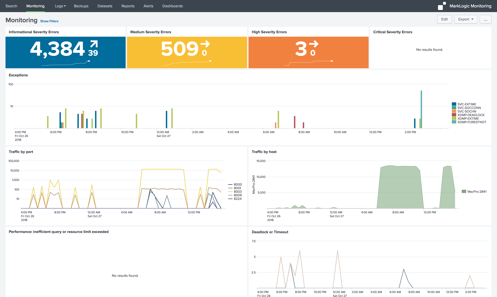

# MarkLogic Monitoring for Splunk

MarkLogic Monitoring for Splunk provides configurations and pre-built dashboards that deliver real-time visibility into Error, Access, and Audit log events 
 to monitor and analyze MarkLogic logs with Splunk.

## Installation

Install this app the same way you would install any Splunk app:
<!-- 
- Automatically from [SplunkBase](https://splunkbase.splunk.com/app/XXXX) 
through *Browse more apps* 
-->
- Manually: download the *marklogic.spl* file and install it in your Splunk instance

## Configuration

The MarkLogic Monitoring app has *source* and *sourcetype* configurations with field extractions for the MarkLogic Error, Access, and Audit logs.

[Forward your MarkLogic logs to Splunk](http://docs.splunk.com/Documentation/Forwarder/latest/Forwarder/HowtoforwarddatatoSplunkEnterprise), 
and consider whether you want to [create a separate index](http://docs.splunk.com/Documentation/Splunk/latest/Indexer/Setupmultipleindexes) for MarkLogic log events.

#### Inputs
Below are example stanzas that can be applied to your *inputs.conf* in order to monitor MarkLogic log events and send to a *marklogic* Splunk index.

    #### Linux path for MarkLogic logs
    [monitor:///var/opt/MarkLogic/Logs]
    disabled = 0
    whitelist = .*Log\.txt$
    #index = marklogic
    
    #### Mac OS X path for MarkLogic logs
    [monitor://*/MarkLogic/Data/Logs]
    disabled = 0
    whitelist = .*Log\.txt$
    #index = marklogic
    
    #### Windows path for MarkLogic logs
    [monitor://*\MarkLogic\Data\Logs]
    disabled = 0
    whitelist = .*Log\.txt$
    #index = marklogic

### Macros
The MarkLogic Monitoring dashboard queries make use of *macros* in order to construct base queries that target 
MarkLogic log events from the MarkLogic sourcetypes for Error, Access, and Audit logs

- *marklogic_index* - search criteria limited to `(index=main OR index=marklogic)`
- *marklogic_access* - restricts searches to the MarkLogic *_AccessLog.txt events
- *marklogic_audit* - restricts searches to the MarkLogic AuditLog.txt events
- *marklogic_error* - restricts searches to the *ErrorLog.txt events

You can change these by modifying the *marklogic*, *marklogic_index*, *marklogic_error*, *marklogic_access*, 
and *marklogic_audit* macros under *Settings > Advanced search > Search macros*.
   

## Getting Help
Submit issues or feature requests at https://github.com/marklogic-community/marklogic-monitoring-for-splunk/issues 

## License

The MarkLogic Monitoring app is licensed under the Apache License 2.0. Details can be found in the [LICENSE](LICENSE) file.